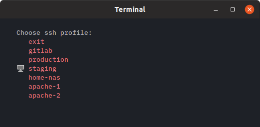

[](https://microbadger.com/images/antonjah/ssh-menu "")
[](https://microbadger.com/images/antonjah/ssh-menu "")
[](https://microbadger.com/images/antonjah/ssh-menu "")


#  sshmenu



sshmenu is a *very* simple terminal tool that reads your ssh-config  
and renders an interactive menu with your ssh profiles listed

## Installation

Install:

```bash
$ sudo pip install ssh-menu
```

Uninstall:

```bash
$ sudo pip uninstall ssh-menu
```

**Note:** sshmenu depends on a config file located in your *user-home*/.ssh folder  
You can find examples [here](https://www.ssh.com/ssh/config/)

## Alias

You can alias sshmenu to make it easier to use

Bash:
```bash
$ echo 'alias ssm="sshmenu"' >> ~/.bashrc
$ source ~/.bashrc
```

Zsh:
```bash
$ echo 'alias ssm="sshmenu"' >> ~/.zshrc
$ source ~/.zshrc
```

Now you can just enter `ssm` to open sshmenu

## Docker

Running in docker (why? I don't know):

```bash
docker run -it -v $PWD/config:/root/.ssh/config antonjah/ssh-menu
```

## Todo

* Enable adding profiles
* Custom profile location
* Handle output even if session dies unexpectedly


### Dependencies

* [sshconf](https://pypi.org/project/sshconf/)
* [console-menu](https://pypi.org/project/console-menu/)
